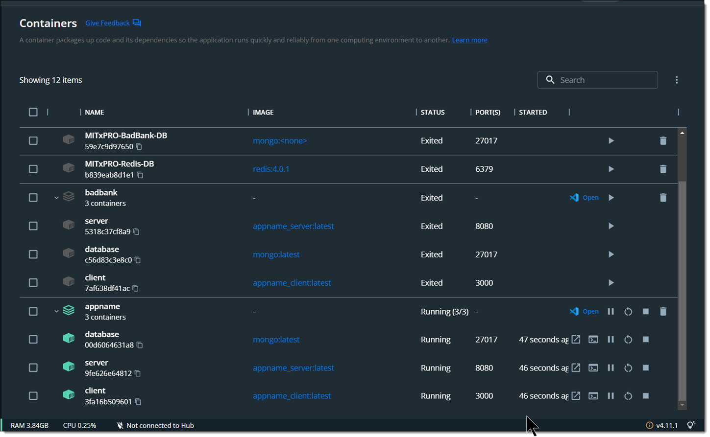

# MITxPRO-DockerMERN
A Full-Stack MERN (Mongo-Express-React-Node) Application in Docker Containers.

* Define ‘appname’ in .env file or the “docker compose up” command takes the directory name as the app name...

```
COMPOSE_PROJECT_NAME=appname
```


* Use in the docker-compose.yml file use ‘container_name: <appname>-<containername>' to explicitly name teh sub-containers with a preofiux matching the 'appname-' and docker desktop does nice things…

```
version: '3'
services:
  client:
    container_name: appname-client
    # Point build step to the client directory
    build: '.\client'
    ports:
      # Add the port that the client application runs on - (port:port).
      - '3000:3000'
    depends_on:
      - server
  server:
    container_name: appname-server
    # Point build step to the server directory
    build: '.\server'
    ports:
      # Add the port that the server application runs on - (port:port).
      - '8080:8080'
    depends_on:
      - mongo
  mongo:
    container_name: appname-database
    image: mongo
    ports:
      - '27017:27017'
```



* To start Client, Server and Database Nodes:
```
docker compose up
```

* To watch the console of any of the Containers (Client-Server-Database):
```
docker logs -f <container-id>
```
